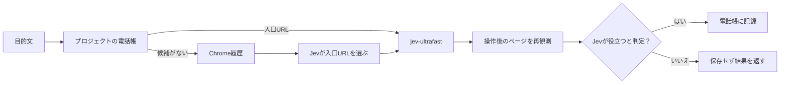

<p align="center"></p>

# Jev Bookmarks

[](https://github.com/quolu/jev-bookmarks/actions/workflows/ci.yml)
[](LICENSE)

> Chrome履歴から目的に合うページを選び、Jevで操作し、役立ったURLだけをGitプロジェクトごとの電話帳に残すCLI。

[English summary](README.en.md) · [設計と受入条件](docs/design.md)

**現在はmacOS向けプレビュー版です。** Chrome拡張は開発者モードで読み込みます。Windowsは未対応です。

## 使い方を30秒で

導入後、対象のGitプロジェクト内で目的を一度だけ渡します。

```sh
cd /path/to/your-project
jev-bookmarks run 'Example Domainのページを表示する'
```

```json
{
  "status": "completed",
  "source": "history",
  "page": {"url": "https://example.com/", "title": "Example Domain"},
  "operation_status": "done",
  "useful": true,
  "saved": true
}
```

上は応答の抜粋です。実際のJSONには選択したURL、操作回数、有用性の確率なども入ります。役立たないページは保存せず、ページと操作結果を返します。



| 方法 | 入口の選択 | 操作後の確認 | 履歴が消えた後 |
| --- | --- | --- | --- |
| Chrome履歴を直接開く | 利用者が探す | 利用者が判断する | 履歴の保持期間に依存 |
| 通常のブックマーク | 利用者が登録する | 利用者が判断する | 残る |
| Jev Bookmarks | 目的文からJevが選ぶ | Jevがページを判定する | 役立ったURLだけプロジェクトに残る |

## 導入

Python 3.12、`uv`、Git、Google Chrome、[TypeSafe](https://docs.typesafe.ai/)のAPIキー、[jev-ultrafast](https://github.com/browser-use/jev-ultrafast)が使うブラウザ接続とモデル設定が必要です。実機確認した環境はmacOSです。

```sh
git clone https://github.com/quolu/jev-bookmarks.git
cd jev-bookmarks
uv sync --locked
uv tool install --editable .
jev-bookmarks install \
  --typesafe-env /path/to/typesafe.env \
  --browser-env /path/to/jev-ultrafast.env
```

`typesafe.env` には `TYPESAFE_API_KEY`、ブラウザ用のenvファイルには上流が必要とするモデル設定とChromeへの接続設定を用意します。秘密の値をこのリポジトリに置かないでください。`install` は端末共通の設定とChrome Native Messaging hostを登録し、拡張ディレクトリと固定拡張IDを表示します。

普段使うChromeの `chrome://extensions` でデベロッパーモードを有効にし、このリポジトリの `extension/` を「パッケージ化されていない拡張機能」として読み込みます。表示されたIDが `install` の出力と一致することを確認してください。拡張は `history` と `nativeMessaging` の権限を使います。上流のBrowser Useも同じChromeプロファイルへ接続する設定が必要です。

```sh
cd /path/to/your-project
jev-bookmarks status
jev-bookmarks run '探したいページで行うこと'
jev-bookmarks list
jev-bookmarks forget 'https://example.com/'
```

`run`・`list`・`forget` は、呼出し元のGitプロジェクトのルートを見つけます。`status` の `history_connected` はローカル接続ソケットの有無を示す目安です。実際の履歴往復は `run` で確認できます。

## 保存と外部送信

- 電話帳は `<プロジェクトルート>/jev-bookmark/bookmarks.json` に保存します。サブディレクトリからの呼出しも同じ電話帳を使います。生成する `.gitignore` はJSONと一時ファイルをGitの追跡対象から外します。
- 電話帳には目的文、観測ページの完全なURL、タイトル、判定時刻が残ります。URLのクエリ文字列にも情報が入り得るので、`list` で確認し、不要なURLは `forget` で削除してください。以前の端末共通の電話帳は自動移行せず、そのまま残します。
- Chrome履歴は要求時に拡張から読み、全件を永続コピーしません。JevへのURL選択では最大80件の候補のタイトル・ホスト名・パスを送ります。操作後の判定ではページの表示文の一部もTypeSafeへ送ります。
- Browser Useが扱うページ情報は、上流のモデル設定にも従います。機密ページを扱う前に、利用するモデルと送信範囲を確認してください。

## 対応状況

| 環境 | 状態 |
| --- | --- |
| macOS + Google Chrome | 実履歴とログイン済みページで確認済み |
| Linux + Google Chrome | コード上の経路あり、実機未検証 |
| Windows | Native Messaging登録と名前付きパイプは未実装 |

<details>
<summary>実機確認と既知の限界</summary>

このMacのChromeに拡張を読み込み、実履歴から80件へ絞った候補を取得した。空の電話帳からURL選択、ブラウザ操作、操作後の再観測、Jevの判定、URL保存まで一回の `run` で確認した。MFクラウド会計の登録済み口座一覧と明細一覧でも目的に合うページを選べた。履歴検索を使わない電話帳の再利用と、役立たないページを保存しない動作も確認した。

二つの一時Gitプロジェクトを作り、片方のサブディレクトリからの実行でそのプロジェクトだけに電話帳ができることを実機で確認した。1万件超の履歴を模した試験では、期間を分割して古い一致ページを取得し、Jevへ渡す候補を80件に制限した。

新しい端末での導入、Linux、Windows、MFの幅広い目的での判定精度は未検証です。Chrome履歴を読むプロファイルとBrowser Useが操作するプロファイルの一致も、設定上の要件として残ります。

</details>

不具合や改善案は [Issues](https://github.com/quolu/jev-bookmarks/issues) へ。個人のURL、ページ本文、APIキーを公開Issueに貼らないでください。[開発への参加](CONTRIBUTING.md)と[セキュリティ報告](SECURITY.md)も参照してください。

## ライセンス

[MIT License](LICENSE)。
