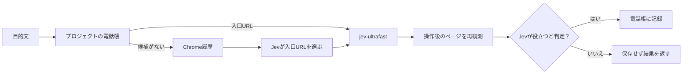

<p align="center"></p>

# Jev Bookmarks

[](https://github.com/kitepon/jev-bookmarks/actions/workflows/ci.yml)
[](LICENSE)

> Chrome履歴から目的に合うページを選び、Jevで操作し、役立ったURLだけをGitプロジェクトごとの電話帳に残すCLI。

[English summary](README.en.md) · [設計と受入条件](docs/design.md)

**プレビュー版です。** macOS・Windows・Linuxで動き、Claude Code・Codex・Cursor・Grok Buildから呼べます。履歴取得とブラウザ操作には、Jev Bookmarksが起動する同じ専用Chromeプロファイルを使います。Chrome拡張もJev Bookmarksが専用プロファイルへ読み込みます。

## 使い方を30秒で

導入後、対象のGitプロジェクト内で目的を一度だけ渡します。

```sh
cd /path/to/your-project
jev-bookmarks run 'Example Domainのページを表示する'
```

```json
{
  "status": "completed",
  "source": "history",
  "page": {"url": "https://example.com/", "title": "Example Domain"},
  "operation_status": "done",
  "useful": true,
  "saved": true
}
```

上は応答の抜粋です。実際のJSONには選択したURL、操作回数、有用性の確率なども入ります。役立たないページは保存せず、ページと操作結果を返します。



| 方法 | 入口の選択 | 操作後の確認 | 履歴が消えた後 |
| --- | --- | --- | --- |
| Chrome履歴を直接開く | 利用者が探す | 利用者が判断する | 履歴の保持期間に依存 |
| 通常のブックマーク | 利用者が登録する | 利用者が判断する | 残る |
| Jev Bookmarks | 目的文からJevが選ぶ | Jevがページを判定する | 役立ったURLだけプロジェクトに残る |

## 導入

Python 3.12、`uv`、Git、Google Chrome、[TypeSafe](https://docs.typesafe.ai/)のAPIキー、[jev-ultrafast](https://github.com/browser-use/jev-ultrafast)が使うモデル設定が必要です。jev-ultrafastは、上流に修正が入るまで[フォーク](https://github.com/quolu/jev-ultrafast)の版を使います（`uv sync` で自動的に入ります）。手順はmacOS・Windows・Linuxで同じです（Windowsは PowerShell で実行します）。

```sh
git clone https://github.com/kitepon/jev-bookmarks.git
cd jev-bookmarks
uv sync --locked
uv tool install --editable .
jev-bookmarks install --typesafe-env /path/to/typesafe.env --browser-env /path/to/jev-ultrafast.env
jev-bookmarks harness install
```

更新する時は `git pull` のあとに `uv sync --locked`、`uv tool install --editable . --force`、`jev-bookmarks harness install` を実行します。Windowsでは、`run` が起動したBrowser Harnessの常駐プロセス（`uv\tools\jev-bookmarks\Scripts\python.exe -m browser_harness.daemon`）が動いている間は入れ直しに失敗するので、先に終了させてください。次の `run` で起動し直します。

`typesafe.env` には `TYPESAFE_API_KEY`、ブラウザ用のenvファイルには上流が必要とするモデル設定を用意します。Chrome接続先はJev Bookmarksが所有するため、`BU_CDP_URL` や `BU_CDP_WS` は読み込みません。秘密の値をこのリポジトリに置かないでください。

`install` は端末共通の設定とChrome Native Messaging hostを登録し、通常のGoogle ChromeをJev Bookmarks専用プロファイルで起動します。Chromeが発行したloopback CDP endpointから、固定IDの履歴拡張を専用プロファイルへ読み込み、Native Messaging hostとの接続まで確認します。手動でデベロッパーモードを有効にする操作はありません。拡張は `history` と `nativeMessaging` の権限を使います。完了時の `status` で `history_connected: true` を確認できます。

専用Chromeは普段使うChromeと履歴・Cookie・ログイン状態を共有しません。必要なサイトへこのウィンドウからログインし、普段のBrowser Useもこのウィンドウに任せます。以後、`run` は専用Chromeを起動し、専用名のBrowser Harnessへ接続します。利用者の `default` Harnessや普段使うChromeへは接続しません。旧版の履歴拡張を普段使うChromeへ読み込んでいた場合は削除できます。

```sh
cd /path/to/your-project
jev-bookmarks status
jev-bookmarks run '探したいページで行うこと'
jev-bookmarks list
jev-bookmarks forget 'https://example.com/'
```

`run`・`list`・`forget` は、呼出し元のGitプロジェクトのルートを見つけます。`status` の `history_connected` は履歴接続のホストが待ち受けているかの目安です。実際の履歴往復は `run` で確認できます。

### ハーネスから使う

`jev-bookmarks harness install` は、見つかったハーネスへ `jev-bookmarks run` の呼び方をスキルとして入れます。以後は「MFの口座一覧を開いて」のように頼むと、ハーネスが目的を一度だけ渡します。特定のハーネスだけに入れる時は `jev-bookmarks harness install claude codex` のように名前を並べます。状態は `jev-bookmarks harness status` で見られます。

| ハーネス | スキルの置き場 | ハーネスごとの注意（スキルに書き込み済み） |
| --- | --- | --- |
| Claude Code | `~/.claude/skills/jev-bookmarks/` | Bashのタイムアウトを10分にして待つ |
| Codex | `$CODEX_HOME/skills/jev-bookmarks/`（既定 `~/.codex`） | ネットワークと履歴接続を使うため、サンドボックスの外で実行する |
| Cursor | `~/.cursor/skills/jev-bookmarks/` | サンドボックス内なら外での実行を求める |
| Grok Build | `~/.grok/skills/jev-bookmarks/` | 終了まで待つ |

スキルは何度入れ直しても同じ結果になります。自分で置いた同名のスキルは上書きしません。

## 保存と外部送信

- 電話帳は `<プロジェクトルート>/jev-bookmark/bookmarks.json` に保存します。サブディレクトリからの呼出しも同じ電話帳を使います。生成する `.gitignore` はJSONと一時ファイルをGitの追跡対象から外します。
- 電話帳には目的文、観測ページの完全なURL、タイトル、判定時刻が残ります。URLのクエリ文字列にも情報が入り得るので、`list` で確認し、不要なURLは `forget` で削除してください。以前の端末共通の電話帳は自動移行せず、そのまま残します。
- Chrome履歴は要求時に拡張から読み、全件を永続コピーしません。JevへのURL選択では最大80件の候補のタイトル・ホスト名・パスを送ります。操作後の判定ではページの表示文の一部もTypeSafeへ送ります。
- Browser Useが扱うページ情報は、上流のモデル設定にも従います。機密ページを扱う前に、利用するモデルと送信範囲を確認してください。

## 対応状況

| 環境 | 状態 |
| --- | --- |
| macOS 27 + Google Chrome 153 | 専用Chromeの起動、履歴拡張の読込、Native Messaging接続、`run` を確認済み |
| Windows 11 + Google Chrome 153 | 同上。対話ログオンのデスクトップと、SSHの両方から確認済み |
| Linux (Ubuntu 26.04 / GNOME Wayland) + Google Chrome 152 | 同上。画面の変数が無いSSHからも、ログイン中の画面セッションへ起動できることを確認済み |

| ハーネス | 状態 |
| --- | --- |
| Claude Code・Codex・Cursor・Grok Build | 0.3.2で、専用Chromeを閉じた状態から各ハーネスがスキル経由で `run` を一度呼び、3 OS×4ハーネスの12通りで、完了とハーネス終了後の専用Chrome・履歴接続の維持を確認した |

専用プロファイルでログインが必要な実サイトの `run` は再確認待ちです。

<details>
<summary>実機確認と既知の限界</summary>

旧版では、このMacの普段使うChromeから実履歴を取得し、空の電話帳からURL選択、ブラウザ操作、操作後の再観測、Jevの判定、URL保存まで一回の `run` で確認した。MFクラウド会計の登録済み口座一覧と明細一覧でも目的に合うページを選べた。履歴検索を使わない電話帳の再利用と、役立たないページを保存しない動作も確認した。

0.3.1では、通常Chromeの専用プロファイルをJev Bookmarksが起動し、そのCDP endpointと専用Browser Harness名を強制した。固定IDの履歴拡張も起動ごとに同じCDP endpointから読み込み、Chrome再起動後のNative Messaging往復を確認した。実際に `jev-ultrafast.Agent` から公開ページのURLとタイトルを観測できた。専用プロファイルでログインが必要な実サイトの `run` は再確認待ち。

二つの一時Gitプロジェクトを作り、片方のサブディレクトリからの実行でそのプロジェクトだけに電話帳ができることを実機で確認した。1万件超の履歴を模した試験では、期間を分割して古い一致ページを取得し、Jevへ渡す候補を80件に制限した。

WindowsとLinuxでの `run` 全体、MFの幅広い目的での判定精度は未検証です。

</details>

不具合や改善案は [Issues](https://github.com/kitepon/jev-bookmarks/issues) へ。個人のURL、ページ本文、APIキーを公開Issueに貼らないでください。[開発への参加](CONTRIBUTING.md)と[セキュリティ報告](SECURITY.md)も参照してください。

## コードの構成

共通コード、OS適合、ハーネス適合をファイル単位で分けています。

| 区分 | ファイル |
| --- | --- |
| 共通 | `cli.py`、`browser.py`、`runner.py`、`typesafe.py`、`phonebook.py`、`settings.py`、`paths.py`、`install.py`、`native_host.py`、`history_bridge.py` |
| OS適合 | `platforms/macos.py`、`platforms/windows.py`、`platforms/linux.py`（macOSとLinuxのUnixソケットは `platforms/posix.py`） |
| ハーネス適合 | `harnesses/claude.py`、`harnesses/codex.py`、`harnesses/cursor.py`、`harnesses/grok.py`（スキルの共通本文は `harnesses/skill.md`） |

各OS・各ハーネスが満たす約束は、それぞれの `__init__.py` に書いています。

## ライセンス

[MIT License](LICENSE)。
