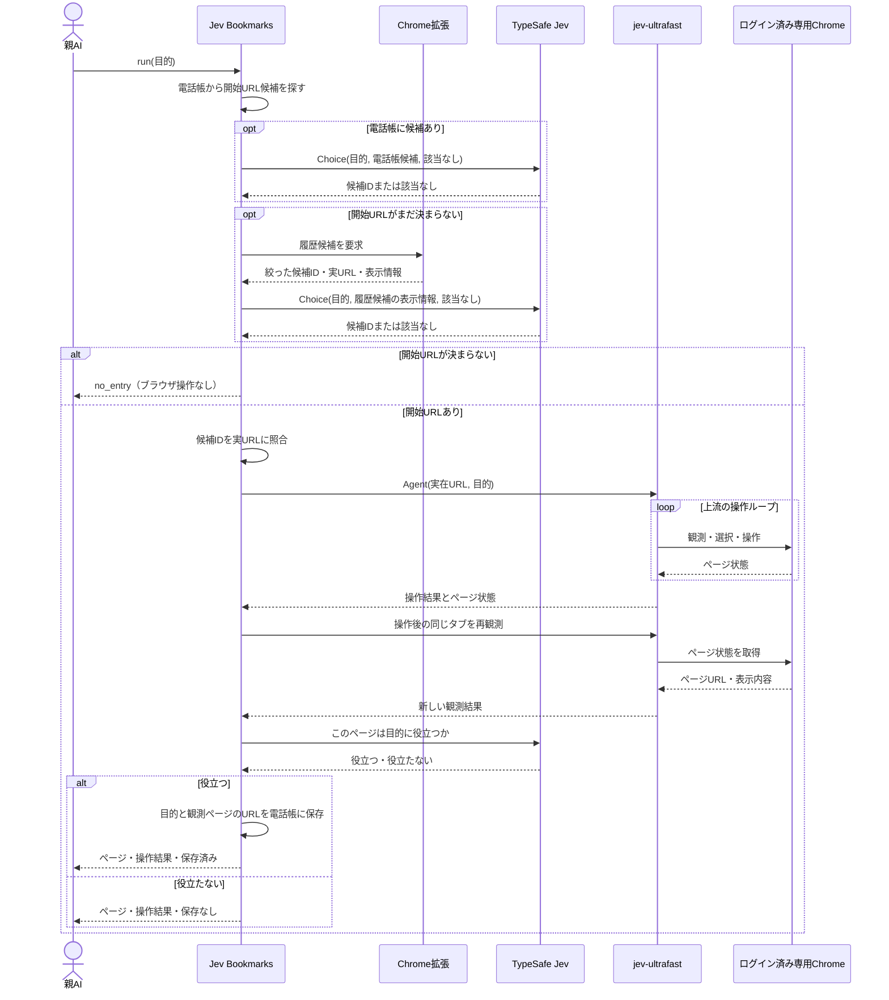

# Jev Bookmarks 製品設計

## 目的

エージェントが「MFで登録済み口座を見たい」のような頼みごとを受けた時、Jev Bookmarks専用Chromeで実際に訪れたページから入口URLを選び、Browser Useまで一回で実行する。操作後にJevが役立つと判定したページを小さな電話帳へ残し、Chrome履歴から消えた後も再利用する。

親AIは目的を一度だけ渡し、途中のURL選択・ブラウザ操作・記録判断に参加しない。Jev Bookmarksが上流 `jev-ultrafast` を呼び、結果まで一つの実行として返す。

## 一回の利用のシーケンス

親AIの通常経路は `run(目的)` の一回だけ。Jev Bookmarksは操作後のページを再観測してJevに有用性を判定させ、その判定どおりに保存して親AIへ結果を返す。`jev-ultrafast` の `DONE` は有用性判定の代わりにしない。親AIが途中で判定する工程や、結果を報告し直す命令は設けない。親AIは返ってきたページと操作結果を見て、通常どおり次の作業か再試行を決める。

## 責務と接続

| 部品 | 責務 |
| --- | --- |
| 専用Chrome管理 | OS標準のGoogle Chromeを製品専用プロファイルとCDP endpointで起動し、専用名のBrowser Harnessへ接続する。利用者の既定Harnessや普段使うChromeは選ばない。 |
| Chrome拡張 | 専用Chromeプロファイルの履歴を正規の `chrome.history.search` で、要求時だけ読む。候補の絞り込みまでをChrome内で行う。 |
| Native Messaging host | Chrome拡張とローカルコマンドを接続する。ブラウザの内部DBを読まない。 |
| Jev Bookmarksのローカルコマンド | `run` の全工程、Jevへの問合せ、操作後の有用性判定、電話帳の永続化を所有する。別に一覧と削除を提供する。 |
| TypeSafe Jev | 有限個のURL候補から選び、操作後のページが目的に役立つかを判定する。 |
| 上流 `jev-ultrafast` | 開始URLと目的を受け取り、Browser Harness経由でChromeを観測・操作する。各操作の選択は上流ループが所有する。上流 browser-use/jev-ultrafast に私たちの修正が入るまでは、フォーク quolu/jev-ultrafast の確認済みの版をコミットで固定して使う。上流に入ったら上流へ戻す。 |

Chrome拡張からホストへは `connectNative` を使う。拡張が起動したホストは同じユーザーだけが接続できるローカルIPCを開き、コマンドからの履歴要求を拡張へ渡す。macOSとLinuxは所有者だけが入れる一時ディレクトリのUnixソケット、Windowsは起動ごとの鍵で相互認証する名前付きパイプを使う。WindowsのChromeはレジストリ（HKCU）に登録したマニフェストを読む。hostは専用拡張のoriginから起動された時だけ待ち受け、待受先と鍵ファイルは0.2系（普段のChromeへ読み込んでいた旧拡張）のものと分ける。普段のChromeに旧拡張が残っていても、専用Chromeの接続を横取りしない。`install` は0.2系が普段のChrome向けに置いたマニフェストを消す。拡張は要求時に履歴を検索して結果を返す。

Jev Bookmarksは通常のGoogle Chromeを端末共通データ配下の専用 `user-data-dir` で起動する。Chromeが書いた `DevToolsActivePort` を検証し、そのloopback endpointから固定IDの履歴拡張を起動ごとに読み込む。同じendpointを `BU_CDP_URL`、専用名 `jev-bookmarks` を `BU_NAME` として上流へ渡す。モデル設定ファイルにあるCDP endpointは読まない。これにより、履歴を持つプロファイルと `jev-ultrafast` が操作するプロファイルの一致を製品が所有する。電話帳から入口が選べれば履歴検索は行わないが、起動時には専用拡張との接続を確認する。接続できなければ `BrowserSetupError`、履歴要求の失敗は `HistoryError`、Browser Useの失敗は `BrowserUseError` を返す。

## OSとハーネスへの適合

共通コードは今のOSやハーネスで分岐しない。OSごとの違いは `platforms/` の一つのファイルに、ハーネスごとの違いは `harnesses/` の一つのファイルに閉じる。

- OS適合（`platforms/macos.py`・`windows.py`・`linux.py`）: 端末共通データの場所、Native Messagingマニフェストの置き場と登録、hostの実行ファイル、履歴接続のローカルIPC（待受と要求）、標準Chromeの探索と起動、CLI起動時の準備を持つ。LinuxはChromeをログイン中の画面セッションを持つユーザーのsystemdから（`systemd-run --user`）起動し、SSHやハーネスの実行環境に画面の変数が無くても開けるようにする。systemdが使えない時は、今の環境に画面の変数がある場合だけ直接起動する。WindowsはChromeをWMI（`Win32_Process.Create`）から起動する。Grok Buildのようにコマンド終了時に子孫プロセスを止めるハーネスや、ジョブごと止めるSSHから呼ばれても、Chromeは呼び出し元の子孫にもジョブにも入らない。macOSは `open` でLaunchServicesから起動する。WindowsはCLIをUTF-8モードで起動し直し、ハーネスへ返すJSONと読み書きするファイルをUTF-8にそろえる。
- ハーネス適合（`harnesses/claude.py`・`codex.py`・`cursor.py`・`grok.py`）: 親AIとなるハーネスに `run` の呼び方を教えるスキルの置き場と、そのハーネスでの実行上の注意（タイムアウト、サンドボックス）を持つ。スキル本文の共通部分は `harnesses/skill.md`。`jev-bookmarks harness install` が入れ、既存の自作スキルは上書きしない。

## 候補の選び方

- 電話帳は保存済みの目的文・タイトル・URLのホスト名とパスを対象にする。候補が複数ならJevへ渡す。電話帳の候補が「該当なし」なら履歴へ進む。
- 履歴はURL・タイトル・訪問回数・最終訪問時刻を利用する。期間と件数は明示して取得する。`chrome.history.search` の期間省略時は直近24時間、件数省略時は100件となるため、省略値に頼らない。件数上限に達した期間は分割して取得し、候補生成前に取りこぼしを検出する。
- 履歴全件を保存せず、要求中だけChrome内で扱う。タイトル・ホスト名・パスの語の一致、訪問回数、最近の訪問を使って有限個に絞る。候補数と順位付けは、実履歴と試験用の頼みごとで計測して決める。
- Jevには目的文と候補のID・タイトル・ホスト名・パスを渡す。URLのクエリ文字列とフラグメント、履歴全件は送らない。戻ったIDをローカルの候補表で実URLに解決する。候補にないURLを生成させない。
- 候補が欠けていればJevには選べない。候補生成の再現率を実測し、足りない時だけサイト単位の段階選択などを追加する。「該当なし」をURLに読み替えず、そのまま返す。

URL選択時の確率分布と操作後の有用性判定は別の値である。現行の応答には、操作後の有用性判定の確率だけを含める。

## 操作後の有用性判定

上流 `jev-ultrafast` が操作を終えたら、Jev Bookmarksは同じタブの現在のページを観測する。Jevに目的とそのページ状態を渡し、「このページは目的に役立つか」を判定させる。`DONE` と `BLOCKED` のどちらで終了しても、ページを観測できたらこの判定を行う。

Jevが役立つと判定したら、その時に観測したページのURLを電話帳へ保存して親AIに返す。役立たないと判定したら保存せず、そのページと操作結果を親AIに返す。親AIからの承認や再判定の入力は待たない。Jevに渡すページ状態は判断に必要な表示情報へ絞り、口座番号・残高などの値を無制限に外部送信しない。判定の精度と送る情報の範囲は実画面で確かめる。

## 電話帳

最小の記録は `目的文・役立つと判定されたページのURL・タイトル・判定時刻`。一つのURLに複数の目的を関連づけられる。電話帳は対象Gitプロジェクトのルートにある `./jev-bookmark/bookmarks.json` に保存し、サブディレクトリからの呼出しも同じファイルへ向ける。JSONは同ディレクトリの `.gitignore` でGitから除外する。一覧と削除は呼出し元のプロジェクトにだけ作用し、履歴から消えたURLも明示的に削除するまで保持する。

入口は目的のページそのものでなくてよい。Jevには「ブラウザ操作エージェントがそのページから数回のクリックで目的のページへたどり着けるか」で選ばせ、目的のページが候補に無くても、同じサイトやサービスの入口（トップ、ドキュメントの目次や導入ページ、ダッシュボード）を選ばせる。`none` は目的と関係するサイトやサービスの候補が一つも無い時だけとする。候補が少ない時に入口を見送らないよう、この定義を問いに明記する。

入口として選んだURLと、操作後に役立つと判定されたページのURLが異なれば、後者を保存する。上流の `DONE`、ページの読み込み成功、URL選択時の確率だけでは電話帳を書かない。

検索時の外部送信には候補の表示情報、操作後の判定には現在ページの必要な表示情報を使う。電話帳には実際に開く完全なURLが残り得る。保存先のアクセス権と、一覧・削除の導線を実装時に確認する。

## 呼び出し契約

タスクの公開入口は `jev-bookmarks run '目的'` の一回とし、結果は機械可読なJSONで返す。完了時は `status`、`goal`、`source`、`selected_url`、`page`、`operation_status`、`actions`、`useful`、`usefulness_probability`、`saved` を返す。`page` にはURL、タイトル、表示文の冒頭を含む。

- `run(goal)` → 観測ページ、上流の操作結果、Jevの有用性判定、電話帳への保存有無を返す。入口がなければ `no_entry`、外部境界の失敗は型付きエラーを返す。
- `list` / `forget` → 電話帳を確認・削除する。

履歴への権限はChrome拡張の `history`、ローカル連携は `nativeMessaging` に限る。専用Chromeの準備、履歴要求、TypeSafe、Browser Use、電話帳、プロジェクト検出の失敗はそれぞれ `BrowserSetupError`、`HistoryError`、`TypeSafeError`、`BrowserUseError`、`PhonebookError`、`ProjectHomeError` としてJSONに表示し、CLIは終了コード1を返す。TypeSafeのAPIが失敗した時も候補を適当に一つ選ばない。`no_entry` ならサイト探索へ無言で切り替えず、親AIには一回の実行結果として返す。

## 最初の実装範囲と受入

1. 親AIの一回の `run` 呼出しの後、URL選択・上流Browser Use・Jevによるページの有用性判定・保存まで内部で進む。親AIへの再判定依頼や結果報告の命令はない。
2. ログイン済みの専用Chromeから正規APIで履歴を取得でき、同じプロファイルを上流Browser Useが操作する。プロファイルとCDP endpointはJev Bookmarksが所有し、内部SQLiteファイルへ直接依存しない。
3. 実履歴の約1万URLを対象にしても、Jevへ送るのは絞った候補だけで、全履歴の永続コピーを作らない。
4. 実際のMFの頼みごと数件について、目的ページが候補に入り、上流が操作し、Jevが操作後のページを役立つ・役立たないに分ける。外れた場合は候補漏れ・URL選択違い・操作失敗・有用性の誤判定を分けて測る。
5. 役立つと判定したページだけを保存する。役立たない場合はページと操作結果を親AIへ返し、電話帳は変更しない。保存したURLは次回、Chrome履歴に存在しなくても見つかる。
6. 専用Chromeの起動・拡張接続、履歴要求、該当なし、TypeSafe障害、操作失敗、保存失敗をそれぞれ区別して表示する。電話帳の一覧と削除が使える。

最初の実装では履歴の常時監視、全履歴の同期、サイトマップ作成、サイト巡回、Browser Use本体の置換は行わない。候補漏れや誤選択が観測されたら、その実例を使って絞り込みと質問を直す。

## 実機確認と残る検証

旧版では、このMacの普段使うChromeに履歴拡張を読み込み、Native Messagingから実履歴の候補80件を取得した。空の電話帳から公開ページを履歴で選び、上流の操作後に同じタブを再観測し、Jevの有用性判定でURLを保存するまで一回の `run` で確認した。二つの一時Gitプロジェクトでは、片方のサブディレクトリからの一回実行でそのプロジェクトだけに電話帳が作られ、もう片方の電話帳は空だった。MFクラウド会計の口座一覧と明細一覧も、実履歴から該当ページを選び、操作後に役立つと判定した。電話帳からの再利用は履歴検索を遮断した条件で確認した。1万件超の履歴を模した試験では、期間分割で古い一致ページを取得し、Jevへの候補を80件に制限した。

0.3.1では、通常Chromeを新しい専用プロファイルと動的CDP portで起動できること、Browser Harnessの接続先と名前が製品所有の値へ固定されること、外部から与えた `BU_CDP_URL` と `BU_CDP_WS` が採用されないことを確認した。`jev-ultrafast.Agent` から公開ページのURLとタイトルを観測し、操作経路が専用Chromeへ届くことも確認した。固定IDの履歴拡張は起動ごとに同じCDP endpointから読み込まれ、専用Chromeを再起動してもNative Messaging hostへ接続し、専用履歴を返す。ログインが必要な実サイトでの一回の `run` は、専用プロファイルへのログイン後に再確認する。

- 実履歴のタイトルとURLだけで、目的ページを十分に候補へ入れられるか。特に略称や、日本語の目的文と英語URLの組合せ。
- Jevが役立つ・役立たないをどの程度正しく判定するか。機密情報を絞ったページ状態で足りるか。
- 保存したページURLの再利用性と、クエリに状態を含むページの扱い。

0.3.2では、macOS・Windows・Linuxの3端末で、専用Chromeを閉じた状態から `install` と `run`（電話帳の入口→1操作→有用性判定→保存）を通した。Linuxは画面の変数が無いSSHから、Windowsは対話ログオンのデスクトップとSSHの両方から確認した。各端末で専用Chromeを閉じてから、Claude Code・Codex・Cursor・Grok Buildの非対話実行でスキル経由の `run` を一度ずつ呼び、12通りすべてで完了とハーネス終了後の専用Chrome・履歴接続の維持を確かめた。普段のChromeに0.2系の拡張とhostが残ったWindowsでも、専用Chromeの履歴接続が通ることを確認した。

旧版では、WindowsではChrome履歴から拡張・名前付きパイプ経由で候補80件を、Linuxでは試験用プロファイルで拡張・Unixソケット経由の往復を確認した。Claude Code・Codex・Cursor・Grok Buildの4ハーネスがスキルを認識することも確かめた。

MFの他の目的についての候補再現率と判定精度、専用プロファイルでログインが必要な実サイトの `run` はまだ確認していない。
