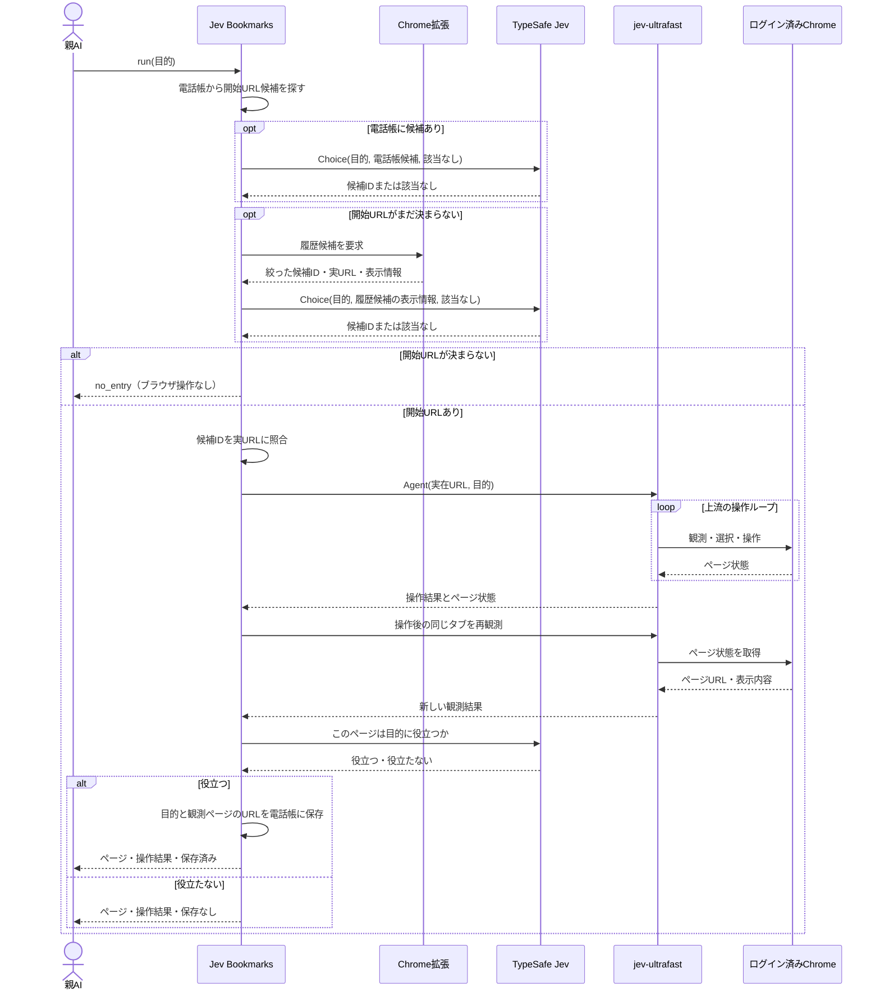

# Jev Bookmarks 製品設計

## 目的

エージェントが「MFで登録済み口座を見たい」のような頼みごとを受けた時、普段使うChromeで実際に訪れたページから入口URLを選び、Browser Useまで一回で実行する。操作後にJevが役立つと判定したページを小さな電話帳へ残し、Chrome履歴から消えた後も再利用する。

親AIは目的を一度だけ渡し、途中のURL選択・ブラウザ操作・記録判断に参加しない。Jev Bookmarksが上流 `jev-ultrafast` を呼び、結果まで一つの実行として返す。

## 一回の利用のシーケンス

親AIの通常経路は `run(目的)` の一回だけ。Jev Bookmarksは操作後のページを再観測してJevに有用性を判定させ、その判定どおりに保存して親AIへ結果を返す。`jev-ultrafast` の `DONE` は有用性判定の代わりにしない。親AIが途中で判定する工程や、結果を報告し直す命令は設けない。親AIは返ってきたページと操作結果を見て、通常どおり次の作業か再試行を決める。

## 責務と接続

| 部品 | 責務 |
| --- | --- |
| Chrome拡張 | 利用中のChromeプロファイルの履歴を正規の `chrome.history.search` で、要求時だけ読む。候補の絞り込みまでをChrome内で行う。 |
| Native Messaging host | Chrome拡張とローカルコマンドを接続する。ブラウザの内部DBを読まない。 |
| Jev Bookmarksのローカルコマンド | `run` の全工程、Jevへの問合せ、操作後の有用性判定、電話帳の永続化を所有する。別に一覧と削除を提供する。 |
| TypeSafe Jev | 有限個のURL候補から選び、操作後のページが目的に役立つかを判定する。 |
| 上流 `jev-ultrafast` | 開始URLと目的を受け取り、Browser Harness経由でChromeを観測・操作する。各操作の選択は上流ループが所有する。 |

Chrome拡張からホストへは `connectNative` を使う。拡張が起動したホストは同じユーザーだけが接続できるローカルIPCを開き、コマンドからの履歴要求を拡張へ渡す。macOS/LinuxではUnixソケット、Windowsでは名前付きパイプをOS適合部分として使い、呼び出し契約は共通にする。拡張がその場で履歴を検索して結果を返す。拡張IDを固定してホスト側で許可する配線と、Chrome起動中に要求を往復できることを、実装の最初の実機検証項目とする。履歴を持つChromeプロファイルと `jev-ultrafast` が操作するプロファイルが同じであることも確認する。履歴接続だけが使えない時は電話帳の候補を使い、履歴が必要なら `HISTORY_UNAVAILABLE` を返す。Browser Harnessが操作対象Chromeへ接続できなければ `BROWSER_UNAVAILABLE` を返す。

## 候補の選び方

- 電話帳は保存済みの目的文・タイトル・URLのホスト名とパスを対象にする。候補が複数ならJevへ渡す。電話帳の候補が「該当なし」なら履歴へ進む。
- 履歴はURL・タイトル・訪問回数・最終訪問時刻を利用する。期間と件数は明示して取得する。`chrome.history.search` の期間省略時は直近24時間、件数省略時は100件となるため、省略値に頼らない。件数上限に達した期間は分割して取得し、候補生成前に取りこぼしを検出する。
- 履歴全件を保存せず、要求中だけChrome内で扱う。タイトル・ホスト名・パスの語の一致、訪問回数、最近の訪問を使って有限個に絞る。候補数と順位付けは、実履歴と試験用の頼みごとで計測して決める。
- Jevには目的文と候補のID・タイトル・ホスト名・パスを渡す。URLのクエリ文字列とフラグメント、履歴全件は送らない。戻ったIDをローカルの候補表で実URLに解決する。候補にないURLを生成させない。
- 候補が欠けていればJevには選べない。候補生成の再現率を実測し、足りない時だけサイト単位の段階選択などを追加する。「該当なし」をURLに読み替えず、そのまま返す。

URL選択時の `confidence` は候補間の確率分布の集中度であり、操作後の有用性判定とは別の値として扱う。

## 操作後の有用性判定

上流 `jev-ultrafast` が操作を終えたら、Jev Bookmarksは同じタブの現在のページを観測する。Jevに目的とそのページ状態を渡し、「このページは目的に役立つか」を判定させる。`DONE` と `BLOCKED` のどちらで終了しても、ページを観測できたらこの判定を行う。

Jevが役立つと判定したら、その時に観測したページのURLを電話帳へ保存して親AIに返す。役立たないと判定したら保存せず、そのページと操作結果を親AIに返す。親AIからの承認や再判定の入力は待たない。Jevに渡すページ状態は判断に必要な表示情報へ絞り、口座番号・残高などの値を無制限に外部送信しない。判定の精度と送る情報の範囲は実画面で確かめる。

## 電話帳

最小の記録は `目的文・役立つと判定されたページのURL・タイトル・判定時刻`。一つのURLに複数の目的を関連づけられる。ローカルの製品専用データとして保存し、Gitには入れない。一覧と削除を提供し、履歴から消えたURLも明示的に削除するまで保持する。

入口として選んだURLと、操作後に役立つと判定されたページのURLが異なれば、後者を保存する。上流の `DONE`、ページの読み込み成功、URL選択時の確率だけでは電話帳を書かない。

検索時の外部送信には候補の表示情報、操作後の判定には現在ページの必要な表示情報を使う。電話帳には実際に開く完全なURLが残り得る。保存先のアクセス権と、一覧・削除の導線を実装時に確認する。

## 呼び出し契約

タスクの公開入口はエージェントが使えるローカルコマンド一つとし、結果は機械可読なJSONで返す。具体的なJSON schemaは接続検証後に固定する。

- `run(goal)` → 観測ページ、上流の操作結果、Jevの有用性判定、電話帳への保存有無を返す。入口がなければ `no_entry`、外部境界の失敗は型付きエラーを返す。
- `list` / `forget` → 電話帳を確認・削除する。

履歴への権限はChrome拡張の `history`、ローカル連携は `nativeMessaging` に限る。履歴接続とBrowser Harness接続の失敗は区別する。TypeSafeのAPIが失敗した時も候補を適当に一つ選ばない。`no_entry` ならサイト探索へ無言で切り替えず、親AIには一回の実行結果として返す。

## 最初の実装範囲と受入

1. 親AIの一回の `run` 呼出しの後、URL選択・上流Browser Use・Jevによるページの有用性判定・保存まで内部で進む。親AIへの再判定依頼や結果報告の命令はない。
2. 利用中のログイン済みChromeから正規APIで履歴を取得でき、同じプロファイルを上流Browser Useが操作する。内部SQLiteファイルへ直接依存しない。
3. 実履歴の約1万URLを対象にしても、Jevへ送るのは絞った候補だけで、全履歴の永続コピーを作らない。
4. 実際のMFの頼みごと数件について、目的ページが候補に入り、上流が操作し、Jevが操作後のページを役立つ・役立たないに分ける。外れた場合は候補漏れ・URL選択違い・操作失敗・有用性の誤判定を分けて測る。
5. 役立つと判定したページだけを保存する。役立たない場合はページと操作結果を親AIへ返し、電話帳は変更しない。保存したURLは次回、Chrome履歴に存在しなくても見つかる。
6. Chrome切断、該当なし、TypeSafe障害、操作失敗、保存失敗をそれぞれ区別して表示する。電話帳の一覧と削除が使える。

最初の実装では履歴の常時監視、全履歴の同期、サイトマップ作成、サイト巡回、Browser Use本体の置換は行わない。候補漏れや誤選択が観測されたら、その実例を使って絞り込みと質問を直す。

## 未検証の点

- ログイン済みChromeへの拡張導入とNative Messagingの往復が、この端末で安定して動くか。
- 実履歴のタイトルとURLだけで、目的ページを十分に候補へ入れられるか。特に略称や、日本語の目的文と英語URLの組合せ。
- 上流の操作終了後、同じタブのページを再観測できるか。
- Jevが役立つ・役立たないをどの程度正しく判定するか。機密情報を絞ったページ状態で足りるか。
- 保存したページURLの再利用性と、クエリに状態を含むページの扱い。

これらは実装の前提として未確認であり、設計完了を動作確認済みとは扱わない。
