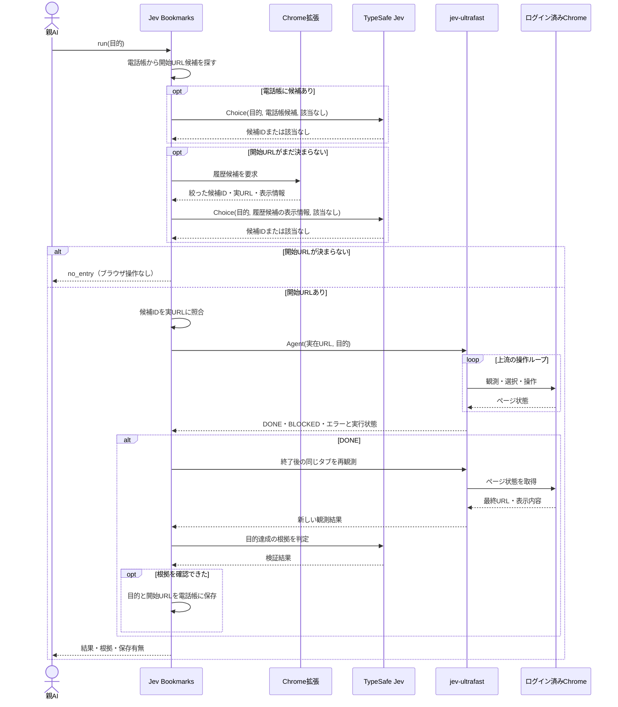

# Jev Bookmarks 製品設計

## 目的

エージェントが「MFで登録済み口座を見たい」のような頼みごとを受けた時、普段使うChromeで実際に訪れたページから入口URLを選び、Browser Useまで一回で実行する。役立った入口だけを小さな電話帳へ残し、Chrome履歴から消えた後も再利用する。

親AIは目的を一度だけ渡し、途中のURL選択・ブラウザ操作・記録判断に参加しない。Jev Bookmarksが上流 `jev-ultrafast` を呼び、結果まで一つの実行として返す。

## 一回の利用のシーケンス

親AIの通常経路は `run(目的)` の一回だけ。`jev-ultrafast` の `DONE` は操作ループの終了を示すもので、目的達成の証明ではない。Jev Bookmarksが終了後のページを改めて観測し、目標に対応する画面上の根拠を確認する。根拠が不足すれば `unverified` として返し、電話帳へは保存しない。`BLOCKED`、接続障害、履歴候補なしも理由を付けて終了する。親AIが途中で `find` や `record_result` を呼ぶ段階はない。

## 責務と接続

| 部品 | 責務 |
| --- | --- |
| Chrome拡張 | 利用中のChromeプロファイルの履歴を正規の `chrome.history.search` で、要求時だけ読む。候補の絞り込みまでをChrome内で行う。 |
| Native Messaging host | Chrome拡張とローカルコマンドを接続する。ブラウザの内部DBを読まない。 |
| Jev Bookmarksのローカルコマンド | `run` の全工程、Jevへの問合せ、実行後の検証、電話帳の永続化を所有する。別に一覧と削除を提供する。 |
| TypeSafe Jev | 有限個のURL候補から選び、操作後の観測結果について目的達成の根拠を判定する。 |
| 上流 `jev-ultrafast` | 開始URLと目的を受け取り、Browser Harness経由でChromeを観測・操作する。各操作の選択は上流ループが所有する。 |

Chrome拡張からホストへは `connectNative` を使う。拡張が起動したホストは同じユーザーだけが接続できるローカルIPCを開き、コマンドからの履歴要求を拡張へ渡す。macOS/LinuxではUnixソケット、Windowsでは名前付きパイプをOS適合部分として使い、呼び出し契約は共通にする。拡張がその場で履歴を検索して結果を返す。拡張IDを固定してホスト側で許可する配線と、Chrome起動中に要求を往復できることを、実装の最初の実機検証項目とする。履歴を持つChromeプロファイルと `jev-ultrafast` が操作するプロファイルが同じであることも確認する。履歴接続だけが使えない時は電話帳の候補を使い、履歴が必要なら `HISTORY_UNAVAILABLE` を返す。Browser Harnessが操作対象Chromeへ接続できなければ `BROWSER_UNAVAILABLE` を返す。

## 候補の選び方

- 電話帳は保存済みの目的文・タイトル・URLのホスト名とパスを対象にする。候補が複数ならJevへ渡す。電話帳の候補が「該当なし」なら履歴へ進む。
- 履歴はURL・タイトル・訪問回数・最終訪問時刻を利用する。期間と件数は明示して取得する。`chrome.history.search` の期間省略時は直近24時間、件数省略時は100件となるため、省略値に頼らない。件数上限に達した期間は分割して取得し、候補生成前に取りこぼしを検出する。
- 履歴全件を保存せず、要求中だけChrome内で扱う。タイトル・ホスト名・パスの語の一致、訪問回数、最近の訪問を使って有限個に絞る。候補数と順位付けは、実履歴と試験用の頼みごとで計測して決める。
- Jevには目的文と候補のID・タイトル・ホスト名・パスを渡す。URLのクエリ文字列とフラグメント、履歴全件は送らない。戻ったIDをローカルの候補表で実URLに解決する。候補にないURLを生成させない。
- 候補が欠けていればJevには選べない。候補生成の再現率を実測し、足りない時だけサイト単位の段階選択などを追加する。「該当なし」をURLに読み替えず、そのまま返す。

Jevの `confidence` は候補間の確率分布の集中度であり、ページが役立つことの証明ではない。固定の成功閾値で自動保存しない。

## 終了後の検証

上流 `jev-ultrafast` は開始URLと目的を受けて自律的に操作するが、その `DONE` は自己申告にすぎない。Jev Bookmarksは同じタブを操作終了後にもう一度観測し、目標に対応する画面上の根拠を別の判断として評価する。検証に使うのは最終URLのホスト名・パス、ページタイトル、見えている見出しや操作部品のラベルなどに絞り、口座番号・残高・本文の値をそのままTypeSafeへ渡さない。

根拠となる観測箇所がなく、目的達成を判断できなければ `unverified`。`DONE`、URLの一致、Jevの高い確率だけでは `verified` にしない。検証の採否条件はMFなど実際の画面で成功・失敗例を集めて確定する。値の確認や送信結果など、絞った観測情報では立証できない目的は、達成したと推測せず `unverified` にする。親AIへ途中の検証を委ねる工程は置かない。

## 電話帳

最小の記録は `目的文・開始URL・タイトル・成功確認時刻`。一つのURLに複数の目的を関連づけられる。ローカルの製品専用データとして保存し、Gitには入れない。一覧と削除を提供し、履歴から消えたURLも明示的に削除するまで保持する。

保存するのは、今回の操作で目的達成につながった開始URL。最終URLはログインの戻り先や操作完了画面などの一時URLかもしれないため、そのまま近道として保存しない。将来、最終URLへ直接入り直して同じ目的を達成できると確かめた場合だけ、短い入口へ更新できる。上流の `DONE`、ページの読み込み成功、Jevの候補選択の確率だけでは電話帳を書かない。

検索時の外部送信には候補の表示情報だけを使う。一方、電話帳には実際に開く完全なURLが残り得る。保存先のアクセス権と、一覧・削除の導線を実装時に確認する。

## 呼び出し契約

タスクの公開入口はエージェントが使えるローカルコマンド一つとし、結果は機械可読なJSONで返す。具体的なJSON schemaは接続検証後に固定する。

- `run(goal)` → `verified`、`unverified`、`blocked`、`no_entry`、または型付きエラー。URL候補の出所、開始URL、最終URL、確認できた根拠、電話帳への保存有無を返す。
- `list` / `forget` → 電話帳を確認・削除する。

履歴への権限はChrome拡張の `history`、ローカル連携は `nativeMessaging` に限る。履歴接続とBrowser Harness接続の失敗は区別する。TypeSafeのAPIが失敗した時も候補を適当に一つ選ばない。`no_entry` ならサイト探索へ無言で切り替えず、親AIには一回の実行結果として返す。

## 最初の実装範囲と受入

1. 親AIの一回の `run` 呼出しの後、URL選択・上流Browser Use・結果検証・保存まで内部で進む。通常経路に親AIの二度目の判断や `record_result` 呼出しがない。
2. 利用中のログイン済みChromeから正規APIで履歴を取得でき、同じプロファイルを上流Browser Useが操作する。内部SQLiteファイルへ直接依存しない。
3. 実履歴の約1万URLを対象にしても、Jevへ送るのは絞った候補だけで、全履歴の永続コピーを作らない。
4. 実際のMFの頼みごと数件について、目的ページが候補に入り、上流が操作し、終了後の観測で達成を検証できる。外れた場合は候補漏れ・Jevの選択違い・操作失敗・検証不能を分けて測る。
5. 開いただけのページ、`DONE` だけのページ、失敗したページは電話帳に入らない。検証した開始URLは次回、Chrome履歴に存在しなくても見つかる。
6. Chrome切断、該当なし、TypeSafe障害、操作失敗、検証不能、保存失敗をそれぞれ区別して表示する。電話帳の一覧と削除が使える。

最初の実装では履歴の常時監視、全履歴の同期、サイトマップ作成、サイト巡回、Browser Use本体の置換は行わない。候補漏れや誤選択が観測されたら、その実例を使って絞り込みと質問を直す。

## 未検証の点

- ログイン済みChromeへの拡張導入とNative Messagingの往復が、この端末で安定して動くか。
- 実履歴のタイトルとURLだけで、目的ページを十分に候補へ入れられるか。特に略称や、日本語の目的文と英語URLの組合せ。
- 上流の操作終了後、同じタブのページを再観測して目的達成を独立に確認できるか。判定を保留する条件と誤保存率。
- 開始URLの再利用性と、クエリに状態を含むページの扱い。
- 機密情報を除いたページ状態だけで、MFの画面到達を検証できるか。

これらは実装の前提として未確認であり、設計完了を動作確認済みとは扱わない。
